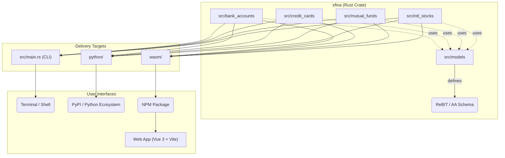

<p align="center">
  <a href="https://github.com/sakthipriyan/xfina" target="_blank">
    
  </a>
</p>

# [Xfina](https://github.com/sakthipriyan/xfina)

[](https://crates.io/crates/xfina)
[](https://pypi.org/project/xfina/)
[](https://www.npmjs.com/package/xfina-wasm)

**Xfina** is a collection of libraries (Rust, Python, JS), a command-line interface (CLI), and a web interface for extracting structured financial data from **Indian** bank statements, credit card statements, mutual fund reports, and international brokerage reports.

All parsers are compiled to **WebAssembly (WASM)** and run entirely in the browser — your financial data never leaves your device. 

🌐 **Live App**: [xfina.sakthipriyan.com](https://xfina.sakthipriyan.com/)

---

## Motivation & Vision

Most open-source financial parsers are written in Python, which requires users to set up a local toolchain and use a command-line interface (CLI), making them difficult to use directly via a web interface.

By building Xfina in **Rust**, we achieve:

1. **Privacy-first WASM Deployment** — WebAssembly (WASM) enables privacy-first tools that can run efficiently in the user's browser without sending sensitive financial data to any server. This zero-setup, browser-based solution empowers anyone who is comfortable with a web browser, Excel, or Google Sheets to easily extract a standardized data format without any technical overhead.
2. **Universal Bindings** — Xfina natively supports Python and JS bindings, allowing the core parsing logic to be used seamlessly across any environment. The project is published to Rust crates, npm, and PyPI.
3. **ReBIT & Sahamati AA Standards** — The internal data schema is heavily built on top of the Sahamati Account Aggregator (AA) and ReBIT standards. Xfina offers a ready-made ReBIT JSON interface out-of-the-box, ensuring interoperability with standard Indian financial ecosystems.

---

## Supported Parsers & Status

| Category | Institution / Provider | Format | Status | Notes |
|---|---|---|---|---|
| 🏦 Bank Account | Axis Bank | XLS | **Production Ready** | Full support |
| 🏦 Bank Account | Bank of Baroda | XLS | **Production Ready** | Full support |
| 🏦 Bank Account | HDFC Bank | XLS | **Production Ready** | Full support |
| 🏦 Bank Account | ICICI Bank | XLS | **Production Ready** | Full support |
| 🏦 Bank Account | State Bank of India | PDF (password protected) | **Production Ready** | Full support |
| 💳 Credit Card | Axis Bank | - | **TODO** | Waiting for the statement to be generated |
| 💳 Credit Card | HDFC Bank | CSV | **Production Ready** | Full support incl. add-on cardholders, reward points |
| 💳 Credit Card | ICICI Bank | XLS | **Production Ready** | Tested card without any add-on cards |
| 📈 Mutual Funds | CAMS | PDF (password protected) | **Production Ready** | Combined Account Statement (CAS) |
| 📈 Mutual Funds | KFinTech | PDF (password protected) | **TODO** | Combined Account Statement (CAS) |
| 🌍 Intl Brokers | Interactive Brokers (IBKR) | CSV | **Production Ready** | Activity statements |

*Note: Bank Account parsers have not been tested with Joint Accounts.*

---

## Architecture

The project is structured as a **Cargo workspace** that unifies data models, parsers, and cross-platform bindings into a single, cohesive repository:



The directory structure is as follows:

```text
xfina/
├── src/                  # Unified xfina Rust crate
│   ├── models/           # Shared data models (ReBIT / AA standard compatible)
│   ├── bank_accounts/    # Bank Account parsers (HDFC, ICICI, SBI, BoB, Axis)
│   ├── credit_cards/     # Credit Card parsers (HDFC, ICICI)
│   ├── mutual_funds/     # Mutual Fund parsers (CAMS)
│   ├── intl_stocks/      # International Broker parsers (IBKR)
│   └── main.rs           # Terminal command-line interface (CLI)
├── wasm/                 # WASM bindings (wasm-bindgen)
├── python/               # Python bindings (pyo3)
├── xtask/                # Custom build scripts and site deployment logic
└── web/                  # Vue 3 + Vite frontend (deployed via GitHub Pages)
```

### Data Models (`xfina-models`)

- **`CreditCardAccount`** — card details, statement period, account summary, transactions, reward points
- **`DepositAccount`** — account info, opening/closing balances, transactions
- **`EquityAccount`** — investor info, stock holdings, corporate actions, trades (International Brokers)
- **`MutualFundsAccount`** — investor info, AMC schemes, NAV, transactions (Mutual Funds)

All data structures inherently map to the Sahamati AA specifications, with project-specific extensions nested in the `xfina` object.

---

## Command Line Interface (CLI)

Xfina provides a blazing fast Rust CLI tool for parsing statements directly from your terminal and exporting them to JSON.

### Installation

```bash
cargo install xfina --features cli
```

### Usage

```bash
xfina <CATEGORY> <INSTITUTION> <FILE> [OPTIONS]
```

**Options:**
- `-p, --password <PWD>`: Password to unlock encrypted PDFs
- `-o, --output <DIR>`: Output file path. Defaults to `<input_file_stem>.json` in the same directory.
- `-f, --format <FORMAT>`: JSON format to output. Either `rebit` or `xfina` (default).

**Examples:**
```bash
# Parse a bank statement
xfina bank-account hdfc statement.xls

# Parse a password-protected mutual fund statement
xfina mutual-fund cams portfolio.pdf --password "mysecret"

# Parse a credit card statement and export to a specific location in strict ReBIT format
xfina credit-card icici statement.xls --output ./exports/january.json --format rebit
```

---

## Rust Library Usage

You can also use Xfina directly as a Rust library in your own projects:

```toml
[dependencies]
xfina = "0.2"
```

```rust
use xfina::bank_accounts::hdfc::parse_hdfc_bank_statement;
use xfina::models::request::ParseRequest;

fn main() {
    let filename = "hdfc_statement.xls";
    let bytes = std::fs::read(filename).unwrap();
    
    // Extract file modified timestamp (Unix epoch seconds)
    let modified_ts = std::fs::metadata(filename)
        .and_then(|m| m.modified())
        .ok()
        .and_then(|t| t.duration_since(std::time::UNIX_EPOCH).ok())
        .map(|d| d.as_secs() as i64);
    
    // Create a ParseRequest and provide metadata to improve parsing accuracy
    let req = ParseRequest::new(&bytes)
        .with_filename(filename)
        .with_modified_timestamp(modified_ts);

    // Parse the statement
    let result = parse_hdfc_bank_statement(req).unwrap();
    
    // The result contains both the validation report and the financial data
    println!("Validation status: {:?}", result.validation.overall);

    // Convert the data to JSON (choose either strict ReBIT or extended Xfina format)
    let json_data = result.data.to_xfina_json();
    println!("{}", serde_json::to_string_pretty(&json_data).unwrap());
}
```

---

## Web App

The [`web/`](./web) directory contains a **Vue 3 + Vite** frontend that uses the WASM module to parse files directly in the browser.

### Features

- 🔒 **100% client-side** — no server, no uploads
- ⚡ **Rust/WASM performance** — parsing in milliseconds
- 📊 **Rich UI** — statement header, account summary, transaction table
- 🌙 **Dark mode** support
- 🏷️ **ReBIT compliance** — Direct JSON serialization into ReBIT structures

### Running Locally

```bash
# 1. Build WASM
cd wasm
wasm-pack build --target web

# 2. Start dev server
cd ../web
npm install
npm run dev
```

### Deployment

Pushed to `main` → GitHub Actions automatically builds the unreleased WASM + Vue site and deploys to `unreleased/` on GitHub Pages.
Tagged releases (`v0.1.3`) → Deploys a permanent, versioned snapshot (`/0.1/`) which is mirrored to the root at [xfina.sakthipriyan.com](https://xfina.sakthipriyan.com/).

---

## Roadmap

### Initial Launch Targets

| Institution / Provider | Bank Account | Credit Card | Mutual Funds | Intl Brokers |
|---|:---:|:---:|:---:|:---:|
| Axis Bank | ✅ | ⏳ | | |
| Bank of Baroda | ✅ | | | |
| CAMS | | | ✅ | |
| HDFC Bank | ✅ | ✅ | | |
| IBKR | | | | ✅ |
| ICICI Bank | ✅ | ✅ | | |
| KFinTech | | | ⏳ | |
| State Bank of India | ✅ | | | |

### Upcoming
- [ ] CSV / JSON export full support
- [ ] KFinTech combined statement parser
- [ ] Axis Credit Card parser

## License

[Apache 2.0](./LICENSE)
